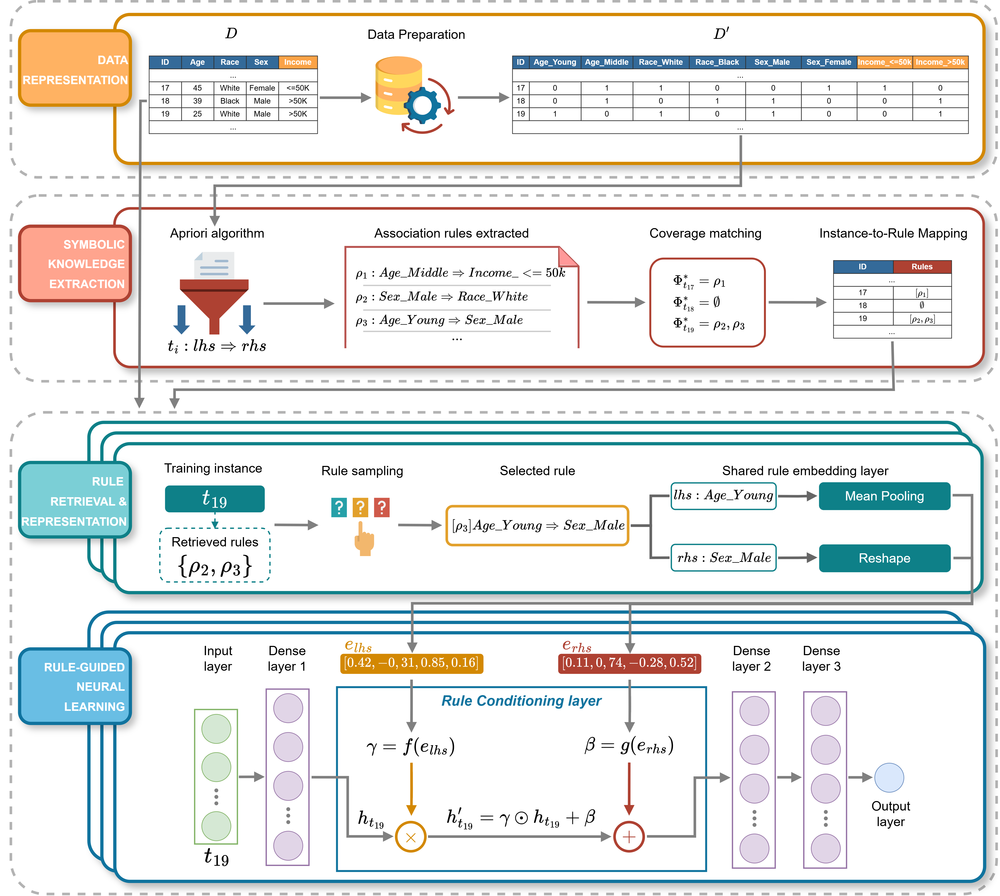
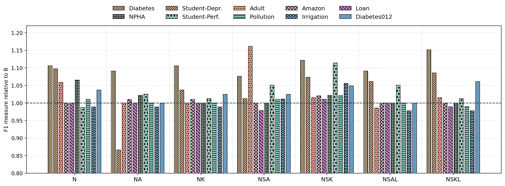
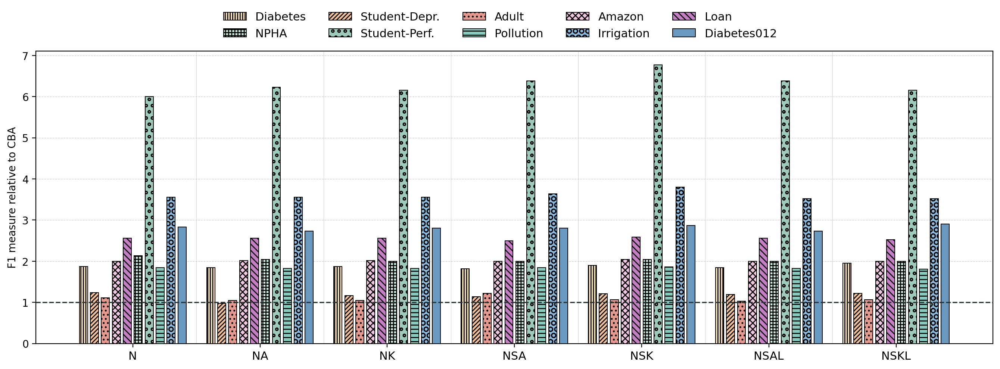
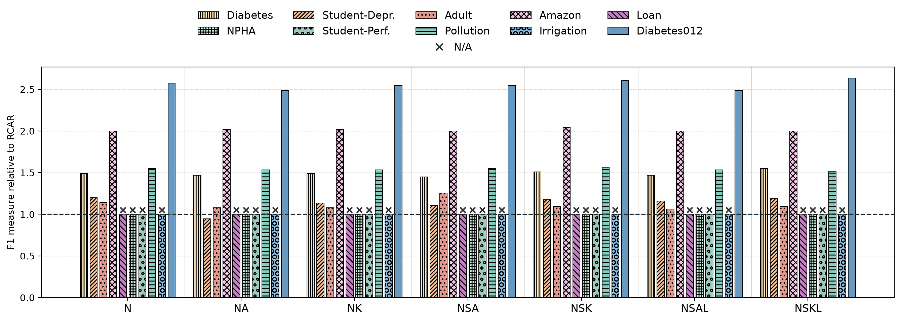

# NARSy

NARSy is a neuro-symbolic framework that integrates association rules, automatically mined from data, into the learning process of a neural network. Through a Rule Conditioning Layer and a FiLM-based mechanism, the extracted rules act as contextual knowledge that dynamically modulates the network's internal representations.

This repository contains the code, the datasets, the mined rules and the experiment outputs of the paper NARSy: Combining Multi-Layer Perceptrons and Association Rules in a Neuro-Symbolic Framework.

## Repository structure

```
NARSy/
├── run_pipeline.py              # preprocessing
├── dataset_registry.py          # per-dataset configuration: target, classes, thresholds, min support/confidence
├── dataset_thresholds.py        # computes the accuracy / lift / Top-K thresholds of each rule set
├── 1_baseline.py                # B    - MLP baseline, no rules
├── 2_CAR.py                     # N    - all global association rules
├── 3_CAR_accuracy.py            # NA   - global rules above an accuracy threshold
├── 4_CAR_top_k.py               # NK   - Top-K global rules by accuracy
├── 5_CAR_split_accuracy.py      # NSA  - per-class rules above an accuracy threshold
├── 6_CAR_split_topk.py          # NSK  - Top-K per-class rules
├── 7_CAR_split_acc_lift.py      # NSAL - per-class rules, lift filter + accuracy threshold
├── 8_CAR_split_topk_lift.py     # NSKL - per-class rules, lift filter + Top-K
├── run_all.sh                   # runs every experiment on every dataset
├── requirements.txt
├── src/
│   ├── models/                  # baseline classifier, CARModel, Rule Conditioning Layer, data sequences
│   ├── rules/                   # rule set classes and utilities
│   ├── preprocessing.py         # header cleaning, discretization, one-hot encoding
│   ├── mining.py                # Apriori mining, global and per class
│   ├── trainer.py               # cross-validated training
│   ├── hyper.py                 # grid search
│   ├── run_final_training.py    # reuse of the best parameters of a previous run
│   └── experiment_utils.py      # run folders, logging, timers
├── supp_conf_threshold/         # adaptive minimum support and confidence sensitivity analyses
├── execution_time/              # training-time analysis
├── data/                        # datasets (raw, preprocessed, one-hot encoded)
├── rules/                       # mined rule sets
├── thresholds/                  # thresholds computed by dataset_thresholds.py
└── results/                     # outputs of the experiments reported in the paper
```


## Model architecture

NARSy injects association rule knowledge directly into the latent representations of a neural network. The rule signal is combined with the network's own representation through a feature-wise affine modulation in the style of FiLM (Feature-wise Linear Modulation). For each instance, the Rule Conditioning Layer (`src/models/layers.py`) computes a scale γ from the embedding of the rule antecedent and a shift β from the embedding of the rule consequent, and transforms the hidden representation `h` of the main branch as `γ ⊙ h + β`. Instances not covered by any rule are left unchanged (γ = 1, β = 0).

<p align="center">
  
</p>


Variants. The experiments compare seven NARSy configurations, which differ in the rules used to
build the conditioning signal:

| Variant | Script | Rule type | Selection |
|---|---|---|---|
| `N`    | `2_CAR.py` | Global association rules | none |
| `NA`   | `3_CAR_accuracy.py` | Global association rules | accuracy threshold |
| `NK`   | `4_CAR_top_k.py` | Global association rules | Top-K by accuracy |
| `NSA`  | `5_CAR_split_accuracy.py` | Class Association Rules (Split) | accuracy threshold per class |
| `NSK`  | `6_CAR_split_topk.py` | Class Association Rules (Split) | Top-K by accuracy per class |
| `NSAL` | `7_CAR_split_acc_lift.py` | Class Association Rules (Split) | lift filter + accuracy threshold per class |
| `NSKL` | `8_CAR_split_topk_lift.py` | Class Association Rules (Split) | lift filter + Top-K by accuracy per class |

Each variant is evaluated against a plain MLP baseline (B, `1_baseline.py`, no rule conditioning)
and against two associative classifiers used directly as predictors, CBA and RCAR.


## Installation

The experiments were run with Python 3.11, and the versions pinned in `requirements.txt` target
that release.

```bash
git clone https://github.com/Ele-C96/NARSy.git
cd NARSy
python -m venv .venv
source .venv/bin/activate       
pip install -r requirements.txt
```


## Data

The ten datasets are included in the repository. Each dataset has its own folder:

```
data/<dataset>/<dataset>.csv           
data/<dataset>/<dataset>_pre.csv       
data/<dataset>/<dataset>_apriori.csv   
```


## Usage

All commands are run from the root of the repository.

1. Preprocessing :

```bash
python run_pipeline.py
```

For every dataset listed in `dataset_registry.py` this writes `<dataset>_pre.csv` and `<dataset>_apriori.csv` in `data/<dataset>/`, the rules in `rules/<dataset>/apriori_<dataset>.json` and one rule file per target class.

2. Rule selection thresholds (optional: the values are already in `dataset_registry.py`):

```bash
python dataset_thresholds.py
```

The thresholds of each dataset are written in `thresholds/<dataset>/results.txt`.

3. Experiments on a single dataset:

```bash
python 1_baseline.py --dataset adult
python 2_CAR.py --dataset adult
python 3_CAR_accuracy.py --dataset adult --accuracy 0.83
python 4_CAR_top_k.py --dataset adult --topk 428
python 5_CAR_split_accuracy.py --dataset adult
python 6_CAR_split_topk.py --dataset adult
python 7_CAR_split_acc_lift.py --dataset adult
python 8_CAR_split_topk_lift.py --dataset adult
```

Every script runs a grid search with 3-fold cross-validation (100 epochs per configuration),
followed by the final 3-fold cross-validated training with the best configuration (200 epochs).

4. All experiments on all datasets:

```bash
bash run_all.sh
```

5. Output. Each run is saved in its own folder:

```
results/<dataset>/<experiment>/run_<timestamp>/
├── config/{dataset}_{variant}_frid.json and experiment_config.json 
├── logs/execution.log
├── metrics/metrics.json 
├── models/(weights and training history of each fold)
└── plots/history_auc_{variant}_{dataset}.png
```


## Results

Across the ten datasets, NSK (Class Association Rules combined with Top-K selection) is the most consistently strong configuration: it achieves the best F1 score on five of the ten datasets and never falls below the MLP baseline on any of the five metrics considered (AUC, Accuracy, F1, Precision, Recall).

<p align="center">
  
</p>
<p align="center">
  
</p>
<p align="center">
  
</p>

## License

This project is released under the MIT License. See the `LICENSE` file for details.

## Contact

Eleonora Calò (ecalo@unisa.it)
